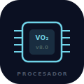
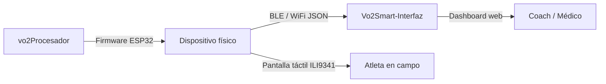

<div align="center">



# VO₂Smart Procesador

**Firmware ESP32 para el dispositivo físico VO₂Smart — LVGL v9 + ILI9341 + XPT2046 Touch + BLE**

[](LICENSE)
[](#hardware)
[](#instalación)
[](#pantallas)
[](#hardware)
[-ffd60a?style=for-the-badge)](#pantallas)

[🌐 **GitHub Pages**](https://csav20.github.io/vo2Procesador/) · [📱 **Web Interface**](https://csav20.github.io/Vo2Smart-Interfaz/app.html) · [🔗 **Repo web**](https://github.com/Csav20/Vo2Smart-Interfaz)

---

*El cerebro del dispositivo. La inteligencia en el hardware.*

</div>

---

## ✨ Qué es

VO₂Smart Procesador es el **firmware ESP32** que corre directamente en el dispositivo físico VO₂Smart. Implementa una interfaz táctil avanzada con **LVGL v9** sobre pantalla **ILI9341 320×240** y touch capacitivo **XPT2046**, con escaneo BLE real, perfiles de usuario persistentes y un dashboard completo de métricas fisiológicas.

```
┌─────────────────────────────────────────────────┐
│             VO₂Smart Ecosystem                  │
│                                                 │
│  [vo2Procesador]  ←BLE/WiFi→  [Interfaz web]   │
│  ESP32-WROOM-32E              Chrome/Edge       │
│  LVGL v9 + ILI9341            Dashboard web     │
│  XPT2046 Touch                IA + Informes     │
│  6 pantallas táctiles         BLE streaming     │
└─────────────────────────────────────────────────┘
```

---

## 📁 Archivos del proyecto

| Archivo | Descripción |
|---|---|
| `vo2smart_ui.cpp` | **UI avanzada v2.0** — LVGL v9 + ILI9341 + XPT2046 Touch + BLE real + 6 pantallas táctiles |
| `screen.cpp` | Firmware UI v8.0 — máquina de 22 pantallas TFT, botones físicos, navegación |
| `gestionusuario.cpp` | Módulo de perfil de usuario — EEPROM, zonas de entrenamiento, VO₂ estimado |

---

## 🖥️ Pantallas LVGL v9 (`vo2smart_ui.cpp`)

Flujo táctil completo de 6 pantallas implementadas con LVGL v9:

| # | Pantalla | Descripción |
|---|---|---|
| 0 | **Splash** | Boot screen VO₂Smart v2.0 — Patente 2024024875 |
| 1 | **Sensor Select** | Tarjetas de selección: Analizador de gases + FC |
| 2 | **BLE Devices** | Escaneo y listado de dispositivos Bluetooth en tiempo real |
| 3 | **User Profile** | Perfil cargado desde Preferences (nombre, edad, peso, altura) |
| 4 | **Start Test** | Pantalla de inicio de prueba de esfuerzo |
| 5 | **Dashboard** | Métricas en vivo: VO₂, VCO₂, FC, VE, RER, Tiempo |

### Dashboard en tiempo real

```
┌──────────────── VO2Smart - En Prueba ──────────────────┐
│  VO2          VCO2           HR                        │
│  45.2 ────── 38.1 ────────── 172                       │
│  (verde)     (naranja)        (rojo)                   │
│                                                        │
│  VE           RER             Tiempo                   │
│  65.3 ────── 0.84 ──────── 12:34                       │
│  (azul)      (violeta)       (amarillo)                │
│                                                        │
│              [ DETENER ]                               │
└────────────────────────────────────────────────────────┘
```

---

## 🖥️ 22 Pantallas TFT (`screen.cpp`)

Firmware v8.0 con máquina de estados completa mediante 2 botones físicos:

| # | Pantalla | Descripción |
|---|---|---|
| 0 | Inicio | Boot screen — VO₂Smart v8.0 |
| 1 | Selección sensores | Búsqueda y conexión FC + VO₂ |
| 2 | Configuración | Setup de conexión BLE/WiFi |
| 3 | Conexión establecida | Confirmación de pairing |
| 4 | Sincronización | Streaming de datos activo |
| 5 | **Dashboard principal** | FC, VO₂, distancia en tiempo real |
| 6 | Métricas biomédicas | Glucosa, lactato, vitamina C |
| 7 | **Entrenamiento en vivo** | Métricas durante ejercicio |
| 8 | Gráficos rendimiento | Visualización histórica |
| 9 | **Análisis metabólico** | RER, sustratos, calorimetría |
| 10 | Recuperación | Post-ejercicio, HRV recovery |
| 11 | Alertas | Notificaciones y umbrales |
| 12 | Configuración sistema | Ajustes del dispositivo |
| 13 | Perfiles usuario | Gestión de atletas |
| 14 | Modo offline | Sin conectividad |
| 15 | Exportación datos | CSV a microSD/BLE |
| 16 | Integración dispositivos | Wearables externos |
| 17 | **Módulo IA** | Recomendaciones locales |
| 18 | Historias clínicas | Registro longitudinal |
| 19 | Simulación pruebas | Test protocolos |
| 20 | Ajustes visualización | UI personalizable |
| 21 | Créditos | Sobre el sistema |

---

## 👤 Perfil de usuario (`gestionusuario.cpp`)

Módulo completo de gestión de perfiles persistidos en EEPROM del ESP32:

### Datos almacenados

```cpp
typedef struct {
    char name[32];          // Nombre del atleta
    uint8_t age;            // Edad
    float weight;           // Peso (kg)
    float height;           // Altura (cm)
    uint8_t gender;         // Género

    sport_type_t sport;     // Deporte principal
    fitness_level_t fitness_level; // Nivel de condición
    uint16_t training_hours_week;  // Horas/semana

    float hr_rest;          // FC reposo
    float hr_max;           // FC máxima
    float vo2_max_tested;   // VO₂max medido
    float vo2_max_estimated; // VO₂max estimado (fórmulas)

    uint8_t preferred_zones; // 3, 5 o 7 zonas
    uint32_t sessions_completed;
    uint32_t checksum;      // Integridad de datos
} user_profile_t;
```

### Deportes soportados

| ID | Deporte |
|---|---|
| 0 | Running |
| 1 | Cycling |
| 2 | Swimming |
| 3 | Triathlon |
| 4 | Rowing |
| 5 | CrossFit |
| 6 | General |

---

## ⚡ Hardware requerido

| Componente | Especificación |
|---|---|
| **MCU** | ESP32-WROOM-32E |
| **Display** | ILI9341 — 320×240 px, SPI |
| **Touch** | XPT2046 — resistivo, 4-wire SPI |
| **UI Framework** | LVGL v9 |
| **Persistencia** | NVS Preferences (vo2smart_ui) / EEPROM (gestionusuario) |

### Pinout (vo2smart_ui.cpp)

| Señal | GPIO ESP32 |
|---|---|
| TFT CS | 15 |
| TFT DC/RS | 2 |
| TFT RESET | EN |
| MOSI | 13 |
| SCK | 14 |
| MISO | 12 |
| Backlight | 21 |
| Touch DOUT | 39 |
| Touch DIN | 32 |
| Touch SCK | 25 |
| Touch CS | 33 |
| Touch IRQ | 36 |

---

## 🚀 Instalación

### Dependencias

```bash
# PlatformIO (recomendado)
pip install platformio
```

Librerías requeridas:

```
TFT_eSPI
TFT_Touch
lvgl (v9.x)
ArduinoJson
BLEDevice (ESP32 BLE Arduino)
Preferences (built-in ESP32)
```

### Compilar y flashear

```bash
git clone https://github.com/Csav20/vo2Procesador.git
cd vo2Procesador

# Con PlatformIO
pio run
pio run --target upload
pio device monitor --baud 115200
```

---

## 🔗 Ecosistema VO₂Smart



| Repo | Descripción |
|---|---|
| **[vo2Procesador](https://github.com/Csav20/vo2Procesador)** | Este repo — firmware ESP32 |
| **[Vo2Smart-Interfaz](https://github.com/Csav20/Vo2Smart-Interfaz)** | Dashboard web BLE |

---

## 🔮 Roadmap

- [x] 22 pantallas TFT navegables (v8.0) — `screen.cpp`
- [x] Gestión de perfiles en EEPROM con checksum
- [x] 7 deportes + 6 niveles de condición física
- [x] Estimación VO₂max y zonas de entrenamiento
- [x] **LVGL v9 + ILI9341 + XPT2046 Touch — UI avanzada v2.0**
- [x] **6 pantallas táctiles con flujo completo Splash→Dashboard**
- [x] **BLE scan real + perfiles desde Preferences NVS**
- [x] **Dashboard tiempo real: VO₂, VCO₂, FC, VE, RER, Tiempo**
- [ ] Integración BLE GATT server para transmisión JSON
- [ ] Logging en microSD
- [ ] OTA updates (Over-The-Air firmware)

---

## 📜 Licencia

MIT — ver [`LICENSE`](LICENSE).

---

## 👨‍💻 Autor

<div align="center">

**ActionSmart® — Claudio Abarca Vargas**

🇨🇱 Chile · [csav20@gmail.com](mailto:csav20@gmail.com) · Patente CL 2024024875

*"La ciencia aplicada al deporte y la salud"*

</div>

---

<div align="center">

> **No es solo código.**
>
> Es la inteligencia fisiológica corriendo en el hardware.

</div>
