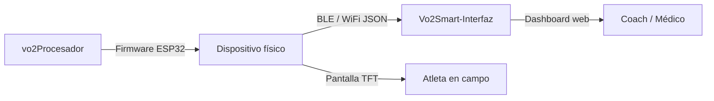

<div align="center">


# VO₂Smart Procesador

**Firmware ESP32 para el dispositivo físico VO₂Smart — 22 pantallas TFT + gestión de perfiles**

[](LICENSE)
[](#hardware)
[](#instalación)
[](#pantallas)
[](#perfil-de-usuario)

[🌐 **GitHub Pages**](https://csav20.github.io/vo2Procesador/) · [📱 **Web Interface**](https://csav20.github.io/Vo2Smart-Interfaz/app.html) · [🔗 **Repo web**](https://github.com/Csav20/Vo2Smart-Interfaz)

---

*El cerebro del dispositivo. La inteligencia en el hardware.*

</div>

---

## ✨ Qué es

VO₂Smart Procesador es el **firmware ESP32** que corre directamente en el dispositivo físico VO₂Smart. Gestiona la interfaz TFT de 22 pantallas y los perfiles de usuario almacenados en EEPROM, complementando la [plataforma web](https://github.com/Csav20/Vo2Smart-Interfaz) que se conecta al dispositivo por BLE.

```
┌─────────────────────────────────────────────┐
│         VO₂Smart Ecosystem                 │
│                                             │
│  [vo2Procesador]  ←BLE/WiFi→  [Interfaz web]│
│  ESP32 firmware               Chrome/Edge  │
│  22 pantallas TFT             Dashboard    │
│  Perfiles EEPROM              IA + Informes │
└─────────────────────────────────────────────┘
```

---

## 📁 Archivos del proyecto

| Archivo | Descripción |
|---|---|
| `screen.cpp` | Firmware UI v8.0 — máquina de 22 pantallas TFT, botones, navegación |
| `gestionusuario.cpp` | Módulo de perfil de usuario — EEPROM, zonas de entrenamiento, VO₂ estimado |

---

## 🖥️ 22 Pantallas TFT

El firmware implementa una máquina de estados con 22 pantallas navegables mediante 2 botones físicos:

| # | Pantalla | Descripción |
|---|---|---|
| 0 | Inicio | Boot screen — VO₂Smart v8.0 |
| 1 | Selección sensores | Búsqueda y conexión FC + VO₂ |
| 2 | Configuración | Setup de conexión BLE/WiFi |
| 3 | Conexión establecida | Confirmación de pairing |
| 4 | Sincronización | Streaming de datos activo |
| 5 | **Dashboard principal** | FC, VO₂, distancia en tiempo real |
| 6 | Métricas biomédicas | Glucosa, lactato, vitamina C |
| 7 | **Entrenamiento en vivo** | Métricas durante ejercicio |
| 8 | Gráficos rendimiento | Visualización histórica |
| 9 | **Análisis metabólico** | RER, sustratos, calorimetría |
| 10 | Recuperación | Post-ejercicio, HRV recovery |
| 11 | Alertas | Notificaciones y umbrales |
| 12 | Configuración sistema | Ajustes del dispositivo |
| 13 | Perfiles usuario | Gestión de atletas |
| 14 | Modo offline | Sin conectividad |
| 15 | Exportación datos | CSV a microSD/BLE |
| 16 | Integración dispositivos | Wearables externos |
| 17 | **Módulo IA** | Recomendaciones locales |
| 18 | Historias clínicas | Registro longitudinal |
| 19 | Simulación pruebas | Test protocolos |
| 20 | Ajustes visualización | UI personalizable |
| 21 | Créditos | Sobre el sistema |

---

## 👤 Perfil de usuario (`gestionusuario.cpp`)

Módulo completo de gestión de perfiles persistidos en EEPROM del ESP32:

### Datos almacenados

```cpp
typedef struct {
    char name[32];          // Nombre del atleta
    uint8_t age;            // Edad
    float weight;           // Peso (kg)
    float height;           // Altura (cm)
    uint8_t gender;         // Género

    sport_type_t sport;     // Deporte principal
    fitness_level_t fitness_level; // Nivel de condición
    uint16_t training_hours_week;  // Horas/semana

    float hr_rest;          // FC reposo
    float hr_max;           // FC máxima
    float vo2_max_tested;   // VO₂max medido
    float vo2_max_estimated; // VO₂max estimado (fórmulas)

    uint8_t preferred_zones; // 3, 5 o 7 zonas
    uint32_t sessions_completed;
    uint32_t checksum;      // Integridad de datos
} user_profile_t;
```

### Deportes soportados

| ID | Deporte |
|---|---|
| 0 | Running |
| 1 | Cycling |
| 2 | Swimming |
| 3 | Triathlon |
| 4 | Rowing |
| 5 | CrossFit |
| 6 | General |

### Niveles de condición física

| ID | Nivel | Descripción |
|---|---|---|
| 0 | Sedentario | < 2 entrenamientos/semana |
| 1 | Principiante | 2–3 entrenamientos/semana |
| 2 | Recreativo | 3–4 entrenamientos/semana |
| 3 | Entrenado | 4–6 entrenamientos/semana |
| 4 | Atleta | > 6 entrenamientos/semana |
| 5 | Elite | Competición de alto nivel |

### Cálculos automáticos

- **FC máxima estimada** — fórmulas por edad/género
- **VO₂max estimado** — ecuaciones ACSM
- **Zonas de entrenamiento** — calculadas desde FC reposo y máxima
- **Factor calorías** — ajustado por perfil del atleta

---

## ⚡ Hardware requerido

| Componente | Especificación |
|---|---|
| **MCU** | ESP32 Dev Module (o ESP32-C6) |
| **Display** | TFT SPI — TFT_eSPI compatible |
| **Botón NEXT** | GPIO 0 |
| **Botón BACK** | GPIO 35 |
| **UI Framework** | LVGL (para gestionusuario) |
| **Persistencia** | EEPROM interna ESP32 |

---

## 🚀 Instalación

### Dependencias

```bash
# PlatformIO (recomendado)
pip install platformio
```

Librerías requeridas (platformio.ini o Arduino IDE):

```
TFT_eSPI
lvgl
ArduinoJson
EEPROM (built-in ESP32)
```

### Compilar y flashear

```bash
# Clonar el repositorio
git clone https://github.com/Csav20/vo2Procesador.git
cd vo2Procesador

# Con PlatformIO
pio run
pio run --target upload
pio device monitor --baud 115200
```

### Con Arduino IDE

1. Abrir `screen.cpp` como sketch principal
2. Incluir `gestionusuario.cpp` en el proyecto
3. Instalar librerías: TFT_eSPI, lvgl, ArduinoJson
4. Seleccionar board: `ESP32 Dev Module`
5. Compilar y subir

---

## 🔗 Ecosistema VO₂Smart

Este firmware es parte de un ecosistema completo:



| Repo | Descripción |
|---|---|
| **[vo2Procesador](https://github.com/Csav20/vo2Procesador)** | Este repo — firmware ESP32 |
| **[Vo2Smart-Interfaz](https://github.com/Csav20/Vo2Smart-Interfaz)** | Dashboard web BLE |

---

## 🔮 Roadmap

- [x] 22 pantallas TFT navegables (v8.0)
- [x] Gestión de perfiles en EEPROM con checksum
- [x] 7 deportes + 6 niveles de condición física
- [x] Estimación VO₂max y zonas de entrenamiento
- [ ] Implementación completa de cada pantalla (métricas reales)
- [ ] Integración BLE GATT server para transmisión JSON
- [ ] Logging en microSD
- [ ] OTA updates (Over-The-Air firmware)
- [ ] LVGL UI completo en todas las pantallas

---

## 📜 Licencia

MIT — ver [`LICENSE`](LICENSE).

---

## 👨‍💻 Autor

<div align="center">

**ActionSmart® — Claudio Abarca Vargas**

🇨🇱 Chile · [csav20@gmail.com](mailto:csav20@gmail.com) · Patente CL 2024024875

*"La ciencia aplicada al deporte y la salud"*

</div>

---

<div align="center">

> **No es solo código.**
>
> Es la inteligencia fisiológica corriendo en el hardware.

</div>
